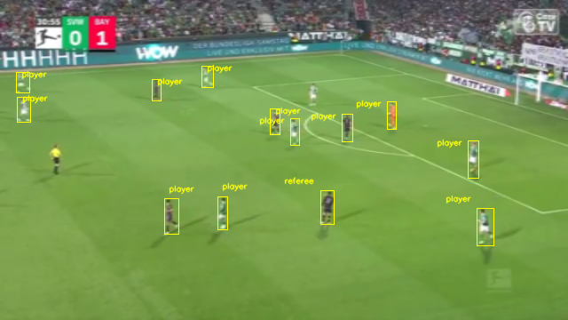
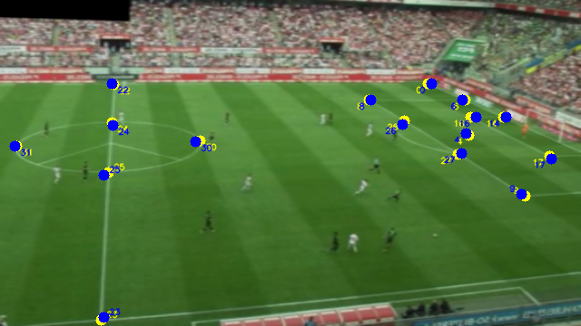

# Computer Vision in Soccer

This repository contains the implementation and supporting materials for a project that uses computer vision and machine learning to analyze soccer matches. The primary goal is to extract real-world player positions from video recordings via homographic transformations, and subsequently use these positions and related features in predictive and analytical models.
## Overview

- Fine tune YOLO for detecting players in video in real time.
- Estimate homographies from video frames using CNN-detected keypoints.
- Further process group team members.
- Analyze shot patterns via clustering (PCA + KMeans).

## Setup

Create environment and install dependencies.

Place Roboflow training detection data in:
- field  : 
`data/00--raw/football-field-detection.v15i.yolov8/`
- player : 
`data/00--raw/football-players-detection.v12i.yolov8/`


## Finetune and Train Models

```bash
# train player detection box YOLO
python3 -m src.model.detect.finetune

# train perspect transformation model
python3 -m src.model.process.trainer
```


<div style="display: flex; justify-content: center; gap: 40px; align-items: flex-start;">

  <div style="text-align: center;">
    
    <div style="margin-top: 5px; font-style: italic; font-size: 12px;">Figure: YOLO-based player detection</div>
  </div>

  <div style="text-align: center;">
    
    <div style="margin-top: 5px; font-style: italic; font-size: 12px;">Figure: Keypoint CNN pose</div>
  </div>

</div>


<!-- ## Full system

See actual models working:
```bash
    python3 -m src.process.real_time
```

  <div style="text-align: center;">
    
    <div style="margin-top: 5px; font-style: italic; font-size: 12px;">Figure: Keypoint CNN pose</div>
  </div> -->


## Future Work

- Real-time homography filtering
- Increase detection accuracy

